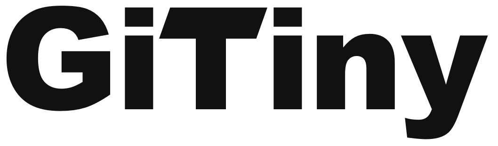
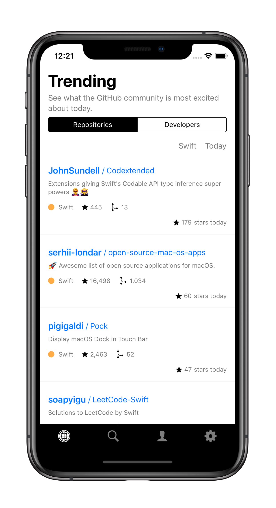
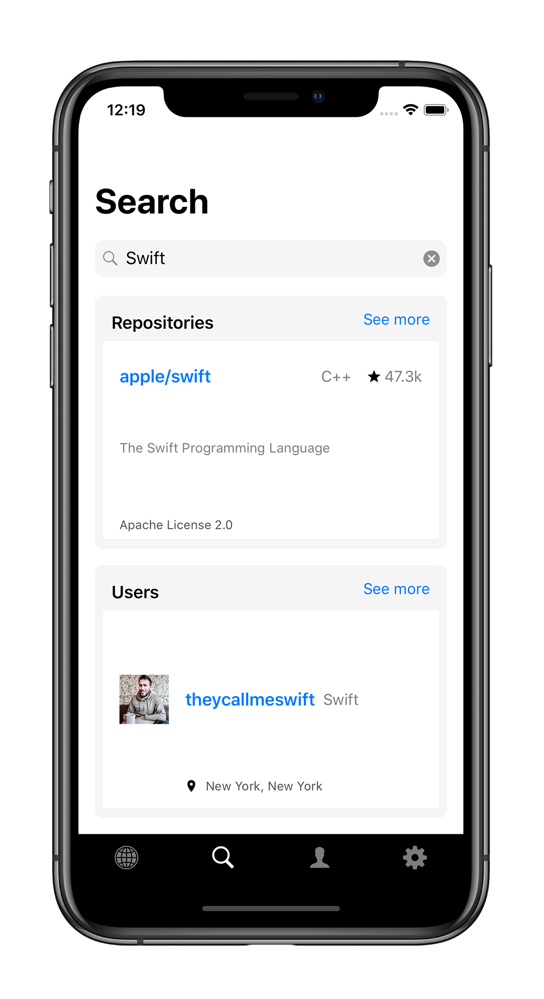
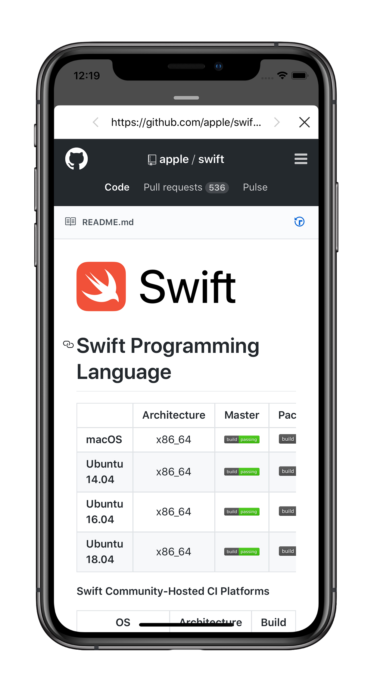
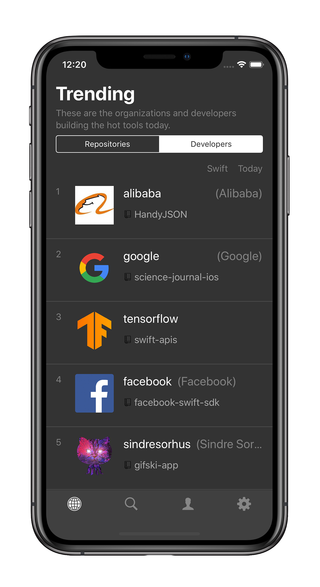

<p align="center">

<br/>
GiTiny is iOS app for GitHub with exploring trending.
<br/>
Written in RxSwift and MVVM-C architecture.
</p>

<p align="center">
<a href="https://travis-ci.org/k-lpmg/GiTiny"></a>
<a href="https://github.com/ReactiveX/RxSwift"></a>
<a href="https://github.com/sergdort/CleanArchitectureRxSwift"></a>


</p>

<p align="center">
<a href="https://itunes.apple.com/app/tiny-github/id1461424565"></a>
</p>

|         | Features  |
----------|-----------------
:fire: | Explore Trending Repositories and Developers
:mag: | Search Repositories and Users
:link: | Easy Web-Sufring with gesture
:no_mouth: | My GitHub profile
:new_moon_with_face: | Dark Theme
:octocat: | 100% Open source


## Screenshots

<p align="center">


</p>
<p align="center">


</p>


## Installation

```sh
git clone https://github.com/k-lpmg/GiTiny.git
cd GiTiny
bundle
bundle exec pod install
open GiTiny.xcworkspace/
```

## References

#### API
* [github-trending-api](https://github.com/huchenme/github-trending-api)
* [GitHub REST API v3](https://developer.github.com/v3/)

#### Network
* [Moya](https://github.com/Moya/Moya)

#### Reactive
* [RxSwift](https://github.com/ReactiveX/RxSwift)
* [RxDataSources](https://github.com/RxSwiftCommunity/RxDataSources)
* [RxGesture](https://github.com/RxSwiftCommunity/RxGesture)

#### Architecture
* [CleanArchitectureRxSwift](https://github.com/sergdort/CleanArchitectureRxSwift)

#### DB
* [realm-cocoa](https://github.com/realm/realm-cocoa)
* [RealmWrapper](https://github.com/k-lpmg/RealmWrapper)

#### UI
* [PanModal](https://github.com/slackhq/PanModal)
* [AwaitToast](https://github.com/k-lpmg/AwaitToast)
* [FluidHighlighter](https://github.com/k-lpmg/FluidHighlighter)

#### Tool
* [SwiftLint](https://github.com/realm/SwiftLint)
* [fastlane](https://docs.fastlane.tools/getting-started/ios/setup/)
* [Crashlytics](https://fabric.io/kits/ios/crashlytics)
* [AcknowList](https://github.com/vtourraine/AcknowList)


## Design

* All Icons - [Icons8](https://icons8.com/app/) 
* AppIcon, Logo, Screenshots, Design support - Kim YuSung
